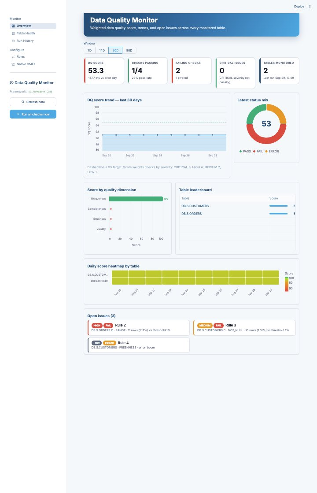

# Data Quality Monitor for Snowflake

**Track data quality on any Snowflake table, without writing code.** Describe what "good data" means as
simple rules. The framework checks those rules on a schedule and records every result. A Streamlit in
Snowflake app shows quality scores, trends, and open issues, and lets you drill into the rows that fail.

Everything runs inside your Snowflake account. No data leaves Snowflake, there's no external service,
and nothing needs installing from PyPI.



---

## Contents

1. [What you get](#what-you-get)
2. [How it works](#how-it-works)
3. [Prerequisites](#prerequisites)
4. [Setup (about 15 minutes)](#setup-about-15-minutes)
5. [Verify the installation](#verify-the-installation)
6. [Monitor your own tables](#monitor-your-own-tables)
7. [Rule reference](#rule-reference)
8. [Customization](#customization)
9. [Security model](#security-model)
10. [Cost](#cost)
11. [Troubleshooting](#troubleshooting)
12. [Uninstall](#uninstall)
13. [Local development and contributing](#local-development-and-contributing)
14. [Repository layout](#repository-layout)

---

## What you get

| | |
|---|---|
| **9 rule types** | Not null, unique (including composite keys), accepted values, range, regex, freshness, row count, referential integrity, custom SQL |
| **DQ score** | A 0–100 score per table, quality dimension, and day, weighted by severity |
| **6 quality dimensions** | Completeness, Uniqueness, Validity, Consistency, Timeliness, Volume |
| **Thresholds** | Set a tolerated failure % per rule (for example, "up to 1% missing emails is OK") |
| **Root-cause drill-down** | Up to 100 failing rows, plus the exact SQL behind every result |
| **Rule builder UI** | Point-and-click database, table, and column pickers, with regex presets |
| **Import / export** | Keep rules in version control as CSV and move them between accounts |
| **Scheduling and alerts** | Daily Snowflake Task, plus an optional email alert on CRITICAL or HIGH failures |
| **Native DMF view** | Shows Snowflake Data Metric Function results next to the rule engine |
| **Sample dataset** | About 1.8M rows of retail data with defects injected on purpose, 30 rules, and 30 days of history for demos and testing |

### App pages

| Page | Purpose |
|---|---|
| **Overview** | Headline KPIs, score trend, status mix, score by dimension, table leaderboard, daily heatmap, open issues |
| **Table Health** | One table in depth: per-check status, failure-rate history vs. threshold, failing-row sample, check SQL, **Run checks** button |
| **Run History** | Every execution, filterable by window, table, status, severity, and trigger; CSV download |
| **Rules** | Edit the catalog (activate, threshold, severity, owner), build new rules, import/export CSV |
| **Native DMFs** | Latest values and trends from `SNOWFLAKE.LOCAL.DATA_QUALITY_MONITORING_RESULTS` |

---

## How it works

```
                     ┌──────────────────── DQ_FRAMEWORK.CORE ─────────────────────┐
                     │                                                            │
   Streamlit app ───►│  DQ_RULES ──► RUN_DQ_CHECKS() ──► DQ_RESULTS ──► views     │──► app, BI, alerts
   (edit rules,      │  (config)     Python stored proc   (history)    V_LATEST_  │
    run checks)      │                ▲  caller's rights               V_DAILY_   │
                     │  DQ_DAILY_RUN ─┘  (scheduled task)              V_TABLE_   │
                     └────────────────────────────┬───────────────────────────────┘
                                                  │ reads (SELECT only)
                                                  ▼
                                   any database / schema / table
```

1. **Rules** are rows in `DQ_RULES`. Each row names a table, a column, a rule type, parameters, a
   severity, and a threshold.
2. **`RUN_DQ_CHECKS()`** turns each rule into a single aggregate SQL query, runs it, and appends one
   row per rule to `DQ_RESULTS`. A broken rule is logged as `ERROR` and doesn't stop the run.
3. **Views** hold all the scoring logic, so you can reuse it in Snowsight dashboards, other BI tools, or alerts.
4. **The app** reads the views, and writes only to `DQ_RULES` or by calling the procedure.

**Scoring.** A check passes when `failed_rows / total_rows × 100 ≤ THRESHOLD_PCT`. The DQ score is the
severity-weighted share of passing checks: CRITICAL = 8, HIGH = 4, MEDIUM = 2, LOW = 1.

---

## Prerequisites

| Requirement | Details |
|---|---|
| Snowflake account | Any edition. Streamlit in Snowflake must be available in your region. |
| Role to install | `SYSADMIN` (databases and warehouse) and `SECURITYADMIN` (roles). `ACCOUNTADMIN` is needed only to grant `EXECUTE TASK`. |
| Compute pool | Needed for the container runtime. Most accounts have `SYSTEM_COMPUTE_POOL_CPU`. Check with `SHOW PARAMETERS LIKE 'DEFAULT_STREAMLIT_COMPUTE_POOL' IN ACCOUNT;` |
| Deploy tool (pick one) | **Snowsight only** (nothing to install), **or** [Snowflake CLI](https://docs.snowflake.com/en/developer-guide/snowflake-cli/installation/installation) v3.14+ |

> **Different names?** The scripts create `DQ_WH`, `DQ_FRAMEWORK.CORE`, `DQ_SAMPLE`, `DQ_ADMIN`, and
> `DQ_VIEWER`. To use your own names, see [Customization](#customization) **before** running the scripts.

---

## Setup (about 15 minutes)

Run the numbered scripts in `sql/` **in order**. The easiest way is to open each file in a Snowsight
worksheet and click **Run All**. You can also run them from a terminal with
`snow sql -f sql/<file>.sql -c <connection>`.

### Step 1: Create the framework (required)

| Script | What it does | Run as |
|---|---|---|
| `sql/01_setup.sql` | Creates warehouse `DQ_WH`, database `DQ_FRAMEWORK`, tables `DQ_RULES` and `DQ_RESULTS`, and the scoring views | SYSADMIN |
| `sql/02_engine.sql` | Creates the `RUN_DQ_CHECKS` procedure and the `DQ_DAILY_RUN` task (created suspended) | SYSADMIN |

### Step 2: Load sample data (optional, recommended for a first run)

| Script | What it does | Time |
|---|---|---|
| `sql/03_sample_data.sql` | Builds `DQ_SAMPLE.RETAIL` (CUSTOMERS 200K, PRODUCTS 5K, ORDERS 1.5M, INVENTORY 50K) with injected defects, registers 30 rules, runs them, and backfills 30 days of history | about 1–2 min on XS |

The sample includes duplicate keys, malformed emails, orphaned foreign keys, invalid statuses, negative
amounts, ship dates before order dates, and a stale feed. Some checks pass and some fail, so every chart
has something to show. Skip this step to start with an empty framework.

### Step 3: Set up roles (recommended)

`sql/04_roles.sql` creates **`DQ_ADMIN`** (manage rules, run checks, own the schedule) and **`DQ_VIEWER`**
(read-only dashboards), with the grants each needs.

> If you skipped Step 2, remove the three `DQ_SAMPLE` grant lines. Add equivalent `SELECT` grants for
> each database you plan to monitor (see [Monitor your own tables](#monitor-your-own-tables)).

### Step 4: Deploy the app (pick one option)

The whole app lives in the `app/` folder. Deploy that folder as-is and **keep its folder structure**:

```
app/
├── streamlit_app.py            ← main file
├── pyproject.toml              ← required by Workspaces; lists only streamlit
├── snowflake.yml               ← deployment settings (warehouse, runtime, compute pool)
├── lib/__init__.py, db.py, ui.py
├── app_pages/__init__.py, overview.py, table_health.py, run_history.py, rules.py, native_dmfs.py
├── .streamlit/config.toml      ← hidden folder; make sure your file browser shows it
└── static/*.ttf                ← 6 font files
```

The app runs on a **compute pool** (container runtime, Python 3.11). It only uses packages that come
pre-installed in that runtime, so **no External Access Integration is needed**. `pyproject.toml` lists
only `streamlit`; without PyPI access, the runtime uses its built-in Streamlit version.

#### Option A: Snowsight Workspaces (recommended, nothing to install)

1. Download this repository: **Code » Download ZIP** on GitHub, then unzip it.
2. In Snowsight, open **Projects » Workspaces** and create or open a workspace
   (for example "Data Quality App").
3. Upload the `app/` folder into the workspace, keeping its subfolders (`lib`, `app_pages`,
   `.streamlit`, `static`). Drag the folder into the file panel, or create each folder and upload
   its files with **+ » Upload files**.
4. Open `app/streamlit_app.py` and click **Run**. The app starts as a private preview on a compute
   pool. Check that the Overview page loads with data.
5. Click **Deploy** in the workspace's project pane and fill in the dialog:
   - **Location:** `DQ_FRAMEWORK` / `CORE`
   - **Execution:** your compute pool (e.g. `SYSTEM_COMPUTE_POOL_CPU`) and query warehouse `DQ_WH`
   - **Sharing:** add `DQ_VIEWER` and `DQ_ADMIN` (optional; you can grant later)
6. Click **Deploy**. To publish later changes, edit in the workspace and click **Deploy** again.

> **Tip:** The query warehouse must be usable by the app's role on its own; secondary roles aren't
> used. If `DQ_WH` doesn't appear in the list, grant `USAGE` on it to the role that owns the app.

#### Option B: SQL from a stage

Use this option to script the deployment.

1. Create a stage:

   ```sql
   CREATE STAGE IF NOT EXISTS DQ_FRAMEWORK.CORE.DQ_APP_STAGE;
   ```

2. Upload the contents of `app/` to `@DQ_FRAMEWORK.CORE.DQ_APP_STAGE/app/`, keeping subfolders.
   Use one of these:
   - **Snowsight:** **Data » Databases » DQ_FRAMEWORK » CORE » Stages » DQ_APP_STAGE » + Files**.
     Upload each folder's files, setting the matching path (`app`, `app/lib`, `app/app_pages`,
     `app/.streamlit`, `app/static`).
   - **Terminal:** from the repository root, using the Snowflake CLI:

     ```bash
     for f in $(cd app && find . -type f ! -name 'snowflake.yml' ! -name '*.example' ! -name '.DS_Store' ! -path '*__pycache__*'); do
       snow stage copy "app/$f" "@DQ_FRAMEWORK.CORE.DQ_APP_STAGE/app/$(dirname "$f")/" --overwrite -c <connection>
     done
     ```

3. Create the app on the compute pool:

   ```sql
   LIST @DQ_FRAMEWORK.CORE.DQ_APP_STAGE/app/;     -- expect 18 files

   CREATE OR REPLACE STREAMLIT DQ_FRAMEWORK.CORE.DATA_QUALITY_MONITOR
     FROM '@DQ_FRAMEWORK.CORE.DQ_APP_STAGE/app/'
     MAIN_FILE = 'streamlit_app.py'
     QUERY_WAREHOUSE = DQ_WH
     RUNTIME_NAME = 'SYSTEM$ST_CONTAINER_RUNTIME_PY3_11'
     COMPUTE_POOL = SYSTEM_COMPUTE_POOL_CPU      -- your pool; see note below
     TITLE = 'Data Quality Monitor';

   ALTER STREAMLIT DQ_FRAMEWORK.CORE.DATA_QUALITY_MONITOR ADD LIVE VERSION FROM LAST;
   ```

   Files are copied when the app is created. To pick up changes later, re-upload the files and
   re-run both statements.

   If you already uploaded the app to a workspace (Option A), you can deploy it with SQL straight from
   the workspace instead of a stage:
   `FROM 'snow://workspace/USER$<YOUR_USER>.PUBLIC."Data Quality App"/versions/live/app'`.

#### Option C: Snowflake CLI (`snow streamlit deploy`)

`app/snowflake.yml` already lists every file and sets the container runtime, compute pool, and
warehouse. The manifest doesn't set a database or schema, so pass them on the command line:

```bash
cd app
snow streamlit deploy --replace -c <connection> --database DQ_FRAMEWORK --schema CORE
```

The app is created as `DATA_QUALITY_MONITOR` (from the entity name in `snowflake.yml`). If your
warehouse or compute pool are different, edit `query_warehouse` / `compute_pool` in `snowflake.yml`.

> **Which compute pool?** Run `SHOW PARAMETERS LIKE 'DEFAULT_STREAMLIT_COMPUTE_POOL' IN ACCOUNT;`.
> Most accounts use `SYSTEM_COMPUTE_POOL_CPU`. The deploying role needs `USAGE` on the pool.

#### After deploying (all options)

Give users access (skip if you added roles in the Workspaces deploy dialog):

```sql
GRANT USAGE ON STREAMLIT DQ_FRAMEWORK.CORE.DATA_QUALITY_MONITOR TO ROLE DQ_VIEWER;
GRANT USAGE ON STREAMLIT DQ_FRAMEWORK.CORE.DATA_QUALITY_MONITOR TO ROLE DQ_ADMIN;
```

Then open **Projects » Streamlit » Data Quality Monitor**. You should see the Overview page with
KPIs, trends, and open issues. With the sample data that's 4 tables and 30 checks.

### Step 5: Turn on the schedule

```sql
ALTER TASK DQ_FRAMEWORK.CORE.DQ_DAILY_RUN RESUME;     -- runs daily at 06:00 UTC
```

To change the timing: `ALTER TASK DQ_FRAMEWORK.CORE.DQ_DAILY_RUN SET SCHEDULE = 'USING CRON 0 */4 * * * UTC';`
(suspend the task first).

**Optional email alerts:** uncomment the `DQ_FAILURE_ALERT` block at the bottom of `sql/02_engine.sql`.
It needs an [email notification integration](https://docs.snowflake.com/en/user-guide/notifications/email-notifications).

---

## Verify the installation

```sql
-- 1. Objects exist
SHOW OBJECTS IN SCHEMA DQ_FRAMEWORK.CORE;

-- 2. The engine runs
CALL DQ_FRAMEWORK.CORE.RUN_DQ_CHECKS();
--   → {"run_id": "...", "rules_executed": 30, "PASS": ..., "FAIL": ..., "ERROR": 0}

-- 3. Scores are computed
SELECT * FROM DQ_FRAMEWORK.CORE.V_TABLE_HEALTH ORDER BY DQ_SCORE;

-- 4. The app exists
SHOW STREAMLITS LIKE 'DATA_QUALITY_MONITOR' IN SCHEMA DQ_FRAMEWORK.CORE;
```

Then open **Projects » Streamlit » Data Quality Monitor** in Snowsight. With the sample data you should
see four tables, 30 checks, and a 30-day trend.

---

## Monitor your own tables

**1. Give the engine read access** to each database you want to monitor. The engine runs with the
caller's rights, so the role that runs checks (`DQ_ADMIN`, and the task owner) must be able to read the data:

```sql
GRANT USAGE  ON DATABASE SALES                 TO ROLE DQ_ADMIN;
GRANT USAGE  ON ALL SCHEMAS IN DATABASE SALES  TO ROLE DQ_ADMIN;
GRANT SELECT ON ALL TABLES  IN DATABASE SALES  TO ROLE DQ_ADMIN;
GRANT SELECT ON FUTURE TABLES IN DATABASE SALES TO ROLE DQ_ADMIN;   -- optional
```

**2. Add rules.** Use whichever method suits you:

- **App:** go to **Rules » New rule**, pick the table and column, choose a rule type, and click **Create rule**.
  Leave **Run immediately** checked to see the result right away.
- **CSV:** go to **Rules » Import / Export**. Export first to get the template, edit it, and upload it.
- **SQL:**

  ```sql
  INSERT INTO DQ_FRAMEWORK.CORE.DQ_RULES
    (RULE_NAME, DATABASE_NAME, SCHEMA_NAME, TABLE_NAME, COLUMN_NAME, RULE_TYPE, RULE_PARAMS,
     THRESHOLD_PCT, SEVERITY, DIMENSION, OWNER)
  SELECT 'Invoice total non-negative', 'SALES', 'PUBLIC', 'INVOICES', 'TOTAL', 'RANGE',
         PARSE_JSON('{"min": 0}'), 0, 'HIGH', 'Validity', 'Finance';
  ```

**3. Run the checks:** use **Run all checks now** in the sidebar, **Run checks** on the Table Health page,
`CALL DQ_FRAMEWORK.CORE.RUN_DQ_CHECKS('SALES.PUBLIC.INVOICES');`, or simply wait for the schedule.

**Starter set for a typical table:** primary key `UNIQUE` (CRITICAL), key columns `NOT_NULL`, foreign
keys `REFERENTIAL`, status or type columns `ACCEPTED_VALUES`, load timestamp `FRESHNESS`, and table-level `ROW_COUNT`.

---

## Rule reference

| Type | `COLUMN_NAME` | `RULE_PARAMS` example | A row / table fails when… |
|---|---|---|---|
| `NOT_NULL` | column | `{}` | the value is NULL |
| `UNIQUE` | `ID` or `A,B` | `{}` | the key appears more than once (every duplicate row counts) |
| `ACCEPTED_VALUES` | column | `{"values": ["OPEN","CLOSED"]}` | a non-NULL value is not in the list |
| `RANGE` | column | `{"min": 0, "max": 100}` | the value is outside the bounds (either bound optional) |
| `REGEX` | column | `{"pattern": "^[0-9]{5}$"}` | a non-NULL value doesn't match |
| `FRESHNESS` | timestamp column | `{"max_age_hours": 24}` | the newest value is older than the limit |
| `ROW_COUNT` | *(leave empty)* | `{"min": 1000, "max": 10000000}` | the row count is outside the bounds |
| `REFERENTIAL` | FK column | `{"ref_table": "DB.SCHEMA.PARENT", "ref_column": "ID"}` | the value doesn't exist in the parent table |
| `CUSTOM_SQL` | any (display only) | `{"failure_condition": "END_DATE < START_DATE"}` | the predicate is TRUE |

**Options on every rule**

| Column | Purpose |
|---|---|
| `ROW_FILTER` | Optional `WHERE` predicate that limits the rows checked, e.g. `STATUS <> 'CANCELLED'` or `LOAD_DATE >= CURRENT_DATE - 7` |
| `THRESHOLD_PCT` | % of failing rows allowed before the check fails (default 0) |
| `SEVERITY` | `CRITICAL`, `HIGH`, `MEDIUM`, or `LOW`; drives the score weight and alerting |
| `DIMENSION` | Grouping for the "score by dimension" chart |
| `OWNER` | Team accountable for fixing failures |
| `IS_ACTIVE` | Deactivate a rule instead of deleting it to keep its history visible |

---

## Customization

The project is built so that a customer can adopt it with minimal edits.

| To change… | Where |
|---|---|
| **Database / schema name** | Find/replace `DQ_FRAMEWORK` (and `CORE`) across `sql/`, then tell the app where to look: set `DQ_FRAMEWORK_SCHEMA = "MY_DB.MY_SCHEMA"` as an environment variable, or edit the default in `app/lib/db.py`. If you deploy with the CLI, pass the new names with `--database` / `--schema` |
| **Warehouse name** | Find/replace `DQ_WH` in `sql/` and `app/snowflake.yml` |
| **Role names** | `sql/04_roles.sql` |
| **App title** | `DQ_APP_TITLE` setting, or the default in `app/lib/db.py` |
| **Colors / fonts / branding** | `app/.streamlit/config.toml` and the color constants at the top of `app/lib/ui.py` |
| **Score weights** | `V_SEVERITY_WEIGHTS` view in `sql/01_setup.sql` |
| **Healthy / warning score bands** | `score_color()` in `app/lib/ui.py` (defaults: ≥95 green, ≥80 amber) |
| **Schedule** | `SCHEDULE` on `DQ_DAILY_RUN` in `sql/02_engine.sql` |
| **Add a rule type** | Add a branch to `build_sql()` in `sql/02_engine.sql`, a test in `tests/test_engine.py`, and a UI option in `app/app_pages/rules.py` (`RULE_TYPES`) |
| **Add a page** | Create `app/app_pages/my_page.py`, register it in `app/streamlit_app.py`, and add it to `artifacts` in `app/snowflake.yml` |

---

## Security model

- **Least privilege.** `RUN_DQ_CHECKS` runs with **caller's rights**, so users can check only tables their
  role can already read. The scheduled task runs as its owner role (`DQ_ADMIN` after `04_roles.sql`).
- **Read-only against your data.** The engine issues only `SELECT` against monitored tables. It writes only
  to `DQ_RESULTS`.
- **Trusted rule authors.** Identifiers are quoted and values are escaped. However, `ROW_FILTER` and
  `CUSTOM_SQL` accept raw SQL predicates by design, so restrict write access on `DQ_RULES` to trusted
  admins. `04_roles.sql` does this: viewers can read everything but can't edit rules or run checks.
- **Parameterized queries.** The app passes every user-supplied value as a bind parameter.
- **No external access.** The app uses only packages bundled with the container runtime. No External
  Access Integration and no outbound network calls are needed.

---

## Cost

- **Checks:** each rule is one aggregate query. The 30 sample rules over about 1.8M rows finish in well
  under a minute on an XS warehouse. `DQ_WH` auto-suspends after 60 seconds.
- **App:** the container runtime runs on the compute pool while the app is in use. Queries run on
  `DQ_WH`, and results are cached for 5 minutes.
- **Storage:** `DQ_RESULTS` grows by one row per rule per run. That's negligible, but you can prune it,
  e.g. `DELETE FROM DQ_RESULTS WHERE RUN_TS < DATEADD('day', -400, CURRENT_TIMESTAMP());`
- **Large tables:** use `ROW_FILTER` to check only recent partitions, e.g. `LOAD_DATE >= CURRENT_DATE - 1`.

---

## Troubleshooting

| Symptom | Fix |
|---|---|
| App says **"Data Quality framework not found"** | `01_setup.sql` hasn't run, or the app points at a different location. Check `DQ_FRAMEWORK_SCHEMA`, and confirm the app's owner role has `USAGE` on the database/schema and `SELECT` on the views. |
| Check shows **ERROR: does not exist or not authorized** | The role running the check can't read that table. Grant `USAGE` + `SELECT` (see [Monitor your own tables](#monitor-your-own-tables)). Scheduled runs use the task owner's role. |
| Check shows **ERROR: invalid identifier** | The column name or `ROW_FILTER` / `CUSTOM_SQL` expression is wrong. Open the rule in **Table Health » Check SQL** to see the generated query. |
| **Save / Run buttons fail** for some users | Expected for `DQ_VIEWER`, which is read-only. Grant `DQ_ADMIN` to users who manage rules. |
| **Task never runs** | Run `ALTER TASK ... RESUME`, and make sure the owner role has `EXECUTE TASK` (`04_roles.sql`). Check `SELECT * FROM TABLE(INFORMATION_SCHEMA.TASK_HISTORY()) ORDER BY SCHEDULED_TIME DESC;` |
| Deploy error mentioning **compute pool** | Use the pool from `SHOW PARAMETERS LIKE 'DEFAULT_STREAMLIT_COMPUTE_POOL' IN ACCOUNT;`, and grant `USAGE` on it to the deploying role. |
| **Installing dependencies failed because the pyproject.toml file does not exist** | Workspaces requires `app/pyproject.toml`. Upload the one from this repo; it lists only `streamlit` and needs no External Access Integration. |
| **Failed to retrieve packages / EAI** | Extra packages were added to `pyproject.toml`. Remove them (the app only needs `streamlit`), or attach a PyPI External Access Integration. |
| **got multiple values for keyword argument 'connection_name'** | You are running an old copy of `app/lib/db.py`. Replace the `app/` folder with the current version from this repo. |
| Native DMFs page says **not accessible** | Grant the `SNOWFLAKE.DATA_QUALITY_MONITORING_VIEWER` application role, or ignore the page if you don't use DMFs. |
| App shows **stale numbers** | Results are cached for 5 minutes. Click **Refresh data** in the sidebar. |

---

## Uninstall

```sql
-- Removes the app, framework, sample data, warehouse, and roles
-- Review first; this is irreversible beyond Time Travel.
-- sql/99_uninstall.sql
```

To remove only the sample data, run the three cleanup statements at the top of `sql/03_sample_data.sql`.

---

## Local development and contributing

```bash
python -m venv .venv && source .venv/bin/activate
pip install -r requirements-dev.txt

# Unit tests for the rule engine + render tests for every page (no Snowflake connection needed)
python -m pytest tests/

# Live check: render every page against your account's DQ_FRAMEWORK data
SNOWFLAKE_DEFAULT_CONNECTION_NAME=<your_connection> python tests/live_check.py

# Run the app locally against your account (uses ~/.snowflake/connections.toml)
cd app
SNOWFLAKE_DEFAULT_CONNECTION_NAME=<your_connection> streamlit run streamlit_app.py
```

The engine's Python lives inside `sql/02_engine.sql`. `tests/test_engine.py` extracts it from that file,
so the tests always cover exactly what gets deployed. After changing the engine, re-run `02_engine.sql`
in Snowflake.

Pull requests are welcome. Please add a test for any new rule type.

---

## Repository layout

```
├── README.md
├── requirements-dev.txt            local dev / tests only
├── docs/overview.jpg
├── sql/
│   ├── 01_setup.sql                warehouse, database, tables, scoring views
│   ├── 02_engine.sql               RUN_DQ_CHECKS procedure, daily task, optional alert
│   ├── 03_sample_data.sql          OPTIONAL demo data + rules + 30-day history
│   ├── 04_roles.sql                DQ_ADMIN / DQ_VIEWER
│   └── 99_uninstall.sql            remove everything
├── app/                            ← Streamlit in Snowflake app (deploy this folder)
│   ├── streamlit_app.py            entry point + navigation
│   ├── app_pages/                  overview, table_health, run_history, rules, native_dmfs
│   ├── lib/db.py                   connection, parameterized queries, framework location
│   ├── lib/ui.py                   theme, KPI cards, charts
│   ├── .streamlit/config.toml      theme
│   ├── static/                     bundled fonts (SiS can't load remote fonts)
│   └── snowflake.yml               manifest for `snow streamlit deploy`
└── tests/
    ├── test_engine.py              rule compiler tests
    └── test_pages.py               page render smoke tests
```
